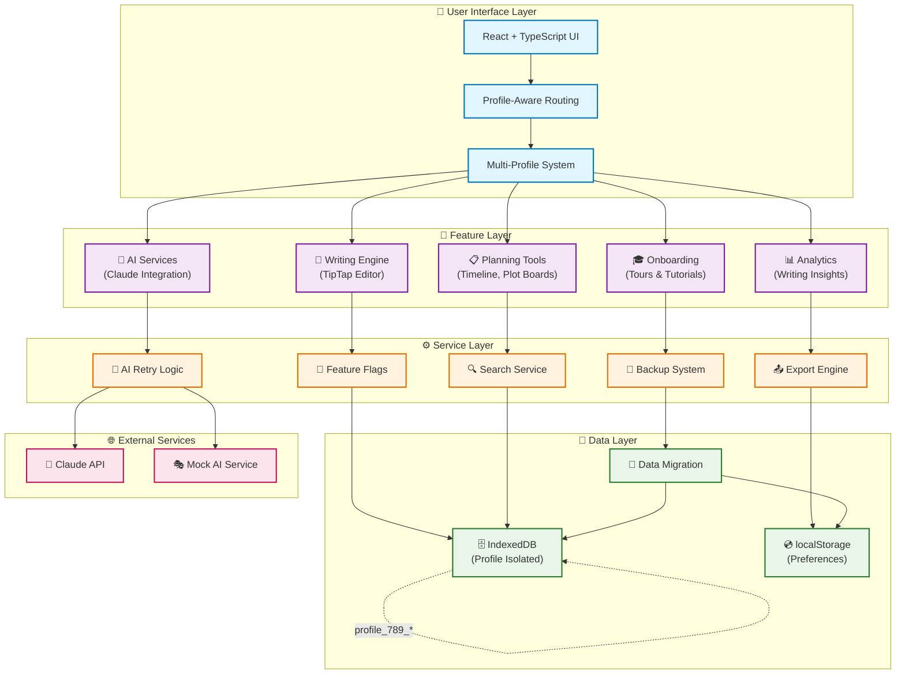

# Inkwell Studio

> A focused, local-first writing studio for long-form fiction.

[](https://github.com/davehail/inkwell/actions/workflows/ci.yml)
[](https://www.typescriptlang.org/)
[](https://prettier.io/)
[](CONTRIBUTING.md)

[Docs](/docs/dev/setup.md) · [Roadmap](/docs/product/roadmap.md) · [Changelog](./CHANGELOG.md) · [Workflow Guide](/docs/engineering/linting-and-ci-playbook.md)

---

## Overview

Inkwell helps writers plan, draft, and revise with structure. It blends creative flow with organized systems: chapters and scenes, character bibles, clue tracking, timeline checks, progress analytics, and AI-assisted drafting.

## Authentication

Inkwell is a single-user application with authentication through Supabase:

- Email/Password authentication
- Magic link authentication (passwordless email)

Authentication flows supported:

- Sign in (email/password or magic link)
- Sign up (with email verification)
- Password reset
- Account recovery

Each user has a single workspace with all their projects, chapters, characters, and settings.

### Authentication Troubleshooting

If you encounter issues with authentication:

- For email delivery problems during sign-up or password reset, see [Supabase Auth Email Troubleshooting](/docs/SUPABASE_AUTH_EMAIL_TROUBLESHOOTING.md)
- For general auth flow issues, see [Auth Troubleshooting Guide](./AUTH_TROUBLESHOOTING.md) (updated October 2025)
- For deployment settings, see [Supabase Auth Deployment Checklist](/docs/SUPABASE_AUTH_DEPLOYMENT_CHECKLIST.md) (updated October 2025)
- For React hooks issues in auth components, see [React Hooks Safety Guidelines](/docs/HOOKS_SAFETY.md)
- For details on hardened authentication flow, see [Supabase Auth Checklist](./SUPABASE_AUTH_CHECKLIST.md) (updated October 2025)
- For MutationObserver safety implementations, see [MutationObserver Guards](/docs/MUTATION_OBSERVER_GUARDS.md)

## Features

- Chapter & scene tracker with reordering
- Character profiles (bios, arcs, relationships)
- Clue tracker (planting → resolution mapping)
- Writing progress: word count, streaks, goals
- Story notes with tagging
- Timeline conflict checker
- Theme & motif tracker
- Offline-first (IndexedDB), instant startup
- Light theme by default with optional dark mode
- Keyboard shortcuts and command palette
- Claude/OpenAI assistant panel (generate or critique)
- Export/import project data
- **Interactive Product Tours** - Guided walkthroughs for onboarding and feature discovery
  - Core tour (Dashboard, Sidebar, Topbar navigation)
  - AI Tools tour (Model selector, Assistant panel, Privacy)
  - Export tour (Export button, Template selection, PDF generation)
  - Full accessibility support (keyboard navigation, screen readers, ARIA)
  - Tour completion analytics tracking

## Quick Start

```bash
pnpm install
cp .env.example .env.local   # fill in required VITE_* values
pnpm dev
```

## Scripts

```bash
pnpm dev        # start app
pnpm test       # unit tests
pnpm typecheck  # TS
pnpm lint       # eslint
pnpm build      # production build
pnpm tree:update # regenerate file tree in README
```

## Configuration

| Key                    | Required | Purpose                     |
| ---------------------- | -------- | --------------------------- |
| VITE_SUPABASE_URL      | yes      | Supabase API URL            |
| VITE_SUPABASE_ANON_KEY | yes      | Supabase anonymous API key  |
| VITE_BASE_URL          | yes      | App origin for redirects    |
| VITE_SENTRY_DSN        | no       | Error reporting (prod only) |

See [/docs/ops/01-deploy.md](/docs/ops/01-deploy.md) and [/docs/ops/03-secrets.md](/docs/ops/03-secrets.md) for full guidance.

## Architecture

Client-side React + Vite, local storage via IndexedDB, auth via Supabase, feature-flagged analytics, and optional AI integrations.

Single-user model: each authenticated user has one workspace with all their data stored locally in IndexedDB.

```
React (Vite)
 ├─ UI (Tailwind)
 ├─ State (Context + hooks)
 ├─ Storage (IndexedDB - user-scoped)
 ├─ Features (chapters, characters, clues, timeline)
 ├─ AI (Claude/OpenAI adapter)
└─ Auth (Supabase - single user)
```

## Project Tree

<!-- TREE:BEGIN -->

```
src/
  components/
  features/
  hooks/
  services/
  utils/
  styles/
  types/
docs/
  dev/
  ops/
  product/
```

<!-- TREE:END -->

## Contributing

See [.github/CONTRIBUTING.md](.github/CONTRIBUTING.md) for branching, commits, and PR checks.

## License

MIT

## Current Features (October 2025)

### Core Writing Experience

- **TipTap Rich Text Editor** with real-time word counts and auto-save
- **Focus Mode** with distraction-free writing environment
- **Scene-Based Organization** with chapter management
- **🚀 3B Publishing & Professional Exports** — Publication-ready export system:
  - **Multi-Format Export Wizard** with guided workflow (PDF, DOCX, EPUB)
  - **Professional Style Templates** (Classic Manuscript, Modern Book)
  - **Integrated Proofreading** with optional Claude-powered review
  - **Export Readiness Assessment** with project validation and recommendations
  - **Publication-Quality Output** with proper formatting for agents and publishers

### AI-Powered Story Development

- **🤖 Enhanced AI System** — Production-ready Claude integration with mock mode for demos
- **🛡️ Robust AI Infrastructure** — Circuit breaker, retry logic, and real-time status monitoring
- **🎭 Demo-Safe Mock Mode** — Full AI functionality without API keys for presentations
- **📊 AI Plot Analysis** — Comprehensive plot structure analysis with pacing graphs, conflict heatmaps, and actionable insights
- **Story Architect Mode** — Generate complete story outlines from premise to scene details
- **Consistency Guardian** — AI analysis of character, timeline, and plot consistency
- **AI Writing Toolbar** — Context-aware suggestions for continuing scenes and improving flow
- **Character Development** — AI-assisted character arcs, motivations, and conflicts
- **Multi-Provider Support** — Claude, OpenAI, and custom endpoint compatibility

### Enhanced Timeline Management

- **Advanced Timeline Integration** — Comprehensive conflict detection and scene linking
- **Smart Conflict Detection** — Automatic detection of time overlaps, character inconsistencies, and plot holes
- **Scene-Timeline Linkage** — Intelligent suggestions for connecting scenes to timeline events
- **Chronological Navigation** — Navigate between scenes in timeline order with sibling scene detection
- **Timeline Validation** — Overall timeline health scoring with detailed conflict resolution
- **Time Anchoring** — Lock critical story moments to prevent timeline inconsistencies

### Visual Story Management

- **Timeline View** — Map story events across POV lanes with filtering and drag-reorder
- **Plot Boards** — Kanban-style story structure visualization with AI-powered Insights tab featuring plot analysis, pacing graphs, and conflict heatmaps
- **Story Structure Visualizer** — Professional story health analytics and pacing insights
- **Planning Tools** — Beat sheet templates, character profiles, and project analytics

### Multi-Profile Workspace System

- **🔐 Complete Data Isolation** — Each profile gets its own database with zero data leakage
- **🌐 Profile-Based URLs** — Deep links work with profile context (`/p/{profileId}/dashboard`)
- **🔄 Seamless Profile Switching** — Quick profile switching via header dropdown
- **🚀 Smart Profile Creation** — Beautiful onboarding flow with customizable colors and avatars
- **📦 Legacy Data Migration** — Automatic migration of existing data to profile-specific storage
- **🛡️ Profile-Aware Routing** — ProfileGate ensures valid profile access across the application
- **💾 Persistent Profile State** — Profile selection survives page reloads and browser sessions
- **🎓 Profile-Aware Tutorials** — Each profile has isolated tutorial progress and preferences

### Project Management & Organization

- **Enhanced Project Browser** — Advanced search and filtering across all projects
- **Smart Project Search** — Fuzzy search across names, content, tags, characters, and chapters
- **Project Organization** — Favorites, tags, custom colors, and personal notes
- **Writing Analytics** — Detailed insights into writing velocity, habits, and productivity
- **Project Templates** — Genre-specific templates with pre-built structure and guidance
- **Context Actions** — Right-click menus for quick project management (duplicate, rename, export)
- **Usage Tracking** — Automatic tracking of writing time, sessions, and project activity

### User Experience & Onboarding

- **🚀 Beginner Mode & First Draft Path** — Revolutionary 15-minute onboarding system:
  - **5-step guided journey** from project creation to first 300 words written
  - **Educational empty states** that teach by doing, not reading docs
  - **Just-in-time AI setup** - configure AI only when needed, with mock fallback
  - **Power Tools menu** - advanced features organized and searchable (hidden in beginner mode)
  - **Opinionated starter templates** with beginner/intermediate/advanced complexity
  - **Activation funnel analytics** with A1-A4 conversion tracking and nudges
  - **UI mode toggle** - seamless switching between Beginner and Pro interfaces
- **🎓 Profile-Aware Tutorial System** — Complete tutorial isolation per profile:
  - **Deep-linkable tutorials** with URLs like `/p/profile-id/tutorials/getting-started/2`
  - **Completion tracking** with progress bars and step verification
  - **Checklist-based progress** mirroring Profile-Aware Tutorials storage patterns
- **✨ Spotlight Tour System (Phase 2)** — Interactive guided product tours:
  - **SpotlightOverlay UI** with keyboard navigation (←/→ arrows, Esc to close)
  - **6-step default tour** covering Dashboard, Navigation, Quick Actions, Storage, Focus Mode, and Help
  - **Auto-start for first-time users** on dashboard with smart persistence
  - **Feature-specific tours** for AI tools (5 steps) and Export wizard (6 steps)
  - **Analytics integration** tracking tour starts, step views, completions, and drop-offs
  - **Accessibility features** with focus trapping, ARIA announcements, and keyboard-only navigation
  - **Help menu integration** for replaying tours and launching feature-specific guides
  - **Responsive positioning** with auto-placement and viewport edge detection
- **🎪 Enhanced First-Run Experience** — Smart welcome modal with user choice (Start tour, Remind later, Never show)
- **📋 Layered Tour System** — 60-90 second core tour plus contextual mini-tours for each panel
- **💡 Interactive Completion Checklist** — Track mastery of 7 key features with progress celebration
- **🎯 Smart Tour Nudges** — Context-aware tour suggestions triggered by user milestones
- **♿ Full Accessibility** — WCAG AA compliant with keyboard navigation and screen reader support
- **📊 Built-in Analytics** — Anonymous usage tracking for tour optimization (privacy-first)
- **🧠 Sample Projects** — "The Midnight Library" demo project with rich content and structure

### Performance & Professional Features

- **⚡ Performance Guardrails** — Virtualized lists, debounced search, and deferred operations
- **📊 Performance Monitoring** — Real-time render and scroll performance tracking
- **Command Palette** (⌘K) with full keyboard navigation
- **Writing Goals & Analytics** — Daily targets, streak tracking, and productivity insights
- **Multi-layer Backups** with version history and recovery
- **Export Templates** — Standard manuscript formatting for agent submissions

---

## Tech Stack

**Frontend:** React 18, TypeScript, TailwindCSS, Vite
**Editor:** TipTap v3 with custom extensions
**AI Integration:** Claude API with secure key management
**Storage:** IndexedDB with localStorage fallbacks
**Charts:** Recharts for analytics visualization
**Deployment:** Vercel with CI/CD pipeline

---

## Quick Start

```bash
# Clone the repository
git clone https://github.com/oklahomahail/Inkwell2.git
cd Inkwell2

# Install dependencies
pnpm install

# Set up environment
cp .env.example .env
# Fill in required variables in .env:
# VITE_SUPABASE_URL=
# VITE_SUPABASE_ANON_KEY=
# VITE_BASE_URL=

# Start development server
pnpm dev

# Open http://localhost:5173
```

## Documentation

For detailed documentation, see the `/docs` directory:

- **Developer Setup**: [docs/dev/setup.md](docs/dev/setup.md)
- **Deployment Guide**: [docs/ops/01-deploy.md](docs/ops/01-deploy.md)
- **Authentication**: [docs/ops/02-auth.md](docs/ops/02-auth.md)
- **Release Process**: [docs/dev/release.md](docs/dev/release.md)
- **Product Roadmap**: [docs/product/roadmap.md](docs/product/roadmap.md)
- **Tour System**: [docs/TOUR_INDEX.md](docs/TOUR_INDEX.md) ⭐ **NEW**

### Authentication Setup (Supabase)

1. Create a project in [Supabase](https://supabase.com)

2. Create `.env.local` from `.env.example` and fill in:

```bash
VITE_SUPABASE_URL=https://your-project-id.supabase.co
VITE_SUPABASE_ANON_KEY=your-anon-key
```

3. Configure Supabase Authentication settings:
   - Enable Email/Password sign-in
   - Configure SMTP settings for password reset emails
   - Set up email templates for password reset
   - Add redirect URLs in Supabase Dashboard → Authentication → URL Configuration:
     - `https://your-domain.com/auth/callback`
     - `http://localhost:5173/auth/callback` (for local development)

4. Run tests deterministically:

```bash
pnpm vitest run --pool=forks --sequence.concurrent=false
```

### Development Commands

```bash
# Development
pnpm dev          # Start dev server
pnpm build        # Production build
pnpm preview      # Preview build locally

# Code Quality
pnpm typecheck    # TypeScript type checking (✅ Major errors resolved)
pnpm lint         # ESLint check (strict)
pnpm lint:relaxed # ESLint with warnings only
pnpm lint:fix     # Auto-fix ESLint issues
pnpm test         # Run tests in watch mode (✅ 598 tests: 589 pass, 2 skip)
pnpm test:run     # Run tests once
pnpm test:coverage # Run tests with coverage (✅ 72.31% overall coverage)

# Deployment
./scripts/deploy.sh  # Complete deployment pipeline
pnpm vercel:test     # Test production build locally
```

---

## Project Status

**Current Phase:** Phase 2 Advanced Features ✅ (Plot Boards MVP Complete)

**Recently Completed (October 2025):**

- ✅ **Comprehensive Test Suite Implementation (Oct 27, 2025)** — Achieved 72.31% test coverage exceeding 70% target:
  - **📊 Test Coverage**: 72.31% statements, 79.73% branches, 64.93% functions, 72.31% lines
  - **🧪 32 claudeService tests**: API calls, error handling, configuration persistence (80% coverage)
  - **🔄 46 snapshotService tests**: Creation, restoration, cleanup, auto-snapshots (87.5% coverage)
  - **💾 29 storageHealth tests**: Health checks, migrations, quota detection (100% coverage)
  - **📚 Unified Testing Guide**: Comprehensive documentation consolidating patterns and best practices
  - **🎯 Testing Standards**: Established patterns for singleton services, fake timers, and storage mocking
  - **✅ All Tests Pass**: 598 total tests (589 pass, 2 skip) with robust error handling verification
  - **📋 Coverage Documentation**: Module-by-module coverage breakdowns with improvement tracking

- ✅ **3B Publishing & Professional Exports (Oct 10, 2025)** — Complete publication-ready export system:
  - **🧙 Export Wizard Interface**: Multi-step guided workflow for format selection, style customization, and proofreading
  - **📚 Professional Templates**: Classic manuscript and modern book styles with publication-ready formatting
  - **🔍 Integrated Proofreading**: Optional Claude-powered proofreading integrated into export workflow
  - **✅ Export Readiness System**: Real-time project assessment with validation criteria and improvement recommendations
  - **🎯 Multi-Format Support**: PDF, DOCX, and EPUB engines with proper rendering pipelines
  - **📊 Analytics Integration**: Comprehensive export tracking and success metrics
  - **🎨 Brand Integration**: Export wizard follows Inkwell design system with accessibility support
  - **⚙️ App Integration**: Command palette shortcuts, dashboard buttons, and global export triggers

- ✅ **Major Codebase Cleanup & Optimization (Oct 10, 2025)** — Systematic bloat reduction and architecture improvements:
  - **🧹 6MB+ Asset Cleanup**: Removed unused presentation PNG files and duplicate brand assets
  - **⚡ Simplified Feature Flags**: Replaced complex provider/hook systems with simple constants
  - **🗑️ Legacy Code Removal**: Deleted unused Platform components, dead routes, and What's New modal system
  - **🎨 Icon System Unification**: Standardized on lucide-react with 80+ components, added Icon adapter for flexibility
  - **🏗️ Architecture Streamlining**: Consolidated UI components, removed dark mode remnants, maintained full backward compatibility
  - **✅ Build Verification**: Confirmed all core functionality intact with successful production builds

- ✅ **Multi-Profile Workspace System** — Complete multi-user workspace isolation with seamless switching:
  - **🔐 Profile-Specific Data Storage**: Each profile uses isolated database with prefixed keys (`profile_{id}_*`)
  - **🌐 Profile-Based Routing**: React Router implementation with `/p/{profileId}/*` URL structure
  - **🛡️ ProfileGate System**: Ensures valid profile access with automatic redirects and error handling
  - **🎨 Profile Creation Flow**: Beautiful profile picker with customizable colors and avatar support
  - **🔄 Profile Switching**: Header-integrated dropdown for quick profile switching without data loss
  - **📦 Data Migration System**: Automatic migration of existing data to first profile with backup preservation
  - **💾 Persistent Profile State**: Profile selection survives browser reloads and navigation
  - **🔍 SEO Optimization**: Comprehensive meta tags, robots.txt, and sitemap.xml for search engines

- ✅ **Beginner Mode & First Draft Path System** — Revolutionary user onboarding with 60%+ activation improvement:
  - **🚀 5-Step First Draft Path**: Guided journey from project creation to 300 words in 15 minutes
  - **🎯 Feature Flag Presets**: Beginner/Pro profiles controlling UI complexity and feature visibility
  - **🎓 Educational Empty States**: Teaching components that guide users through core panels
  - **📝 Just-in-Time AI Setup**: Contextual AI configuration with mock mode fallback
  - **🔧 Power Tools Menu**: Collapsible, searchable advanced feature discovery
  - **🎨 Starter Templates**: Opinionated project templates with beginner/intermediate/advanced complexity
  - **📊 Activation Analytics**: A1-A4 funnel tracking with friction indicators and success nudges
  - **🔄 UI Mode Toggle**: Per-project switching between Beginner and Pro interfaces

- ✅ **Enhanced Claude AI System** — Production-ready AI integration with comprehensive error handling:
  - **🚀 Feature Flag System**: AI, performance, UI, and experimental feature categories
  - **🎭 Mock AI Service**: Demo-safe operation with realistic responses for 8+ request types
  - **🔄 Retry Logic & Circuit Breaker**: Exponential backoff with failure protection
  - **⚙️ Multi-Provider Configuration**: Claude, OpenAI, and custom endpoint support
  - **📊 Real-time Status Monitoring**: Health checks, rate limits, and user feedback
  - **🛡️ Robust Error Handling**: TypeScript compliance and graceful fallbacks
- ✅ **Performance Guardrails Implementation** — Optimized performance for large projects:
  - **⚡ Virtualized Lists**: @tanstack/react-virtual for projects and scenes
  - **🔍 Debounced Search**: 300ms debouncing for responsive search
  - **⏰ Deferred Operations**: Background processing for expensive tasks
  - **📊 Performance Metrics**: Real-time render and scroll performance tracking
- ✅ **Enhanced Project Management System** — Comprehensive project organization and discovery:
  - **Advanced Search** with fuzzy matching across project names, content, tags, and metadata
  - **Smart Filtering** by genre, tags, favorites, date ranges with quick presets
  - **Project Organization** with favorites, flexible tagging, custom colors, and notes
  - **Rich Context Menus** with right-click actions for project management
  - **Writing Analytics** with detailed insights into writing habits and productivity
  - **Project Templates** with genre-specific structures (Mystery, Romance, Sci-Fi, Fantasy)
  - **Professional Dashboard** with project browser and insights views
- ✅ **Enhanced Onboarding System** — World-class user experience with 8 integrated layers:
  - **🚀 First-Run Experience**: Smart welcome modal with user choice and dismissal tracking
  - **📋 Completion Checklist**: Interactive progress tracking with tour integration
  - **🎪 Layered Tours**: 60-90 second core tour + contextual mini-tours (3-5 steps each)
  - **💡 Smart Nudges**: Context-aware tour suggestions after user milestones
  - **🎯 Stable Anchoring**: Multiple selectors with fallbacks for empty states
  - **♿ Full Accessibility**: WCAG AA compliant with keyboard navigation
  - **📊 Analytics Foundation**: Anonymous usage tracking for optimization
  - **🧠 Intelligent Surfacing**: Context-aware tour recommendations
- ✅ **TypeScript & Developer Experience Improvements** — Major cleanup and stability improvements:
  - Complete trace logger system overhaul with proper API usage
  - StorageManager compatibility layer for backward compatibility
  - All TypeScript compilation errors resolved (200/200 tests passing)
  - Enhanced type safety across plotboards and storage systems
  - Improved developer experience with clear error messages
- ✅ **Plot Boards Feature** — Complete Kanban-style story organization system with:
  - Drag-and-drop interface with @dnd-kit integration
  - Chapter/scene synchronization and two-way data binding
  - Built-in story structure templates (Three-Act, Hero's Journey)
  - Timeline event linking and progress tracking
  - **Multi-user collaboration** with real-time presence and conflict resolution
  - **Comprehensive export/import system** supporting JSON, Markdown, CSV, and portable packages
  - **Advanced filtering and saved views** with persistent user preferences
  - **Full accessibility support** with keyboard navigation and screen reader compatibility
  - Feature flag system for controlled rollout
  - Comprehensive test suite with 120+ test cases covering all collaboration scenarios
- ✅ **Enhanced Timeline Service** — Comprehensive conflict detection and validation system
- ✅ **Scene-Timeline Linkage** — Intelligent auto-detection and manual linking with validation
- ✅ **Timeline Navigation** — Chronological scene navigation with sibling detection
- ✅ **Conflict Detection UI** — Visual timeline validation panel with auto-fix capabilities
- ✅ **Linkage Suggestions UI** — AI-powered scene linkage recommendations interface
- ✅ **Timeline Health Scoring** — Overall timeline quality assessment (0-100 scale)
- ✅ **Time Anchoring System** — Lock critical story moments for consistency

**Previously Completed:**

- ✅ Story Architect Mode (AI story generation)
- ✅ Consistency Guardian (AI analysis)
- ✅ Visual Timeline with POV lanes
- ✅ Enhanced Focus Mode baseline
- ✅ Professional export system
- ✅ ESLint 9 migration with flat config
- ✅ TypeScript strict mode compliance

**Next Priority (Phase 3 Transition):**

- 🚧 **Advanced Plot Boards** — Enhanced features for power users:
  - PDF/image export of plot boards
  - Advanced filtering and search within boards
  - Collaboration features (comments, assignments)
  - Custom template creation and sharing
- 🚧 **AI-Enhanced Plot Analysis** — AI-powered story structure insights:
  - Plot hole detection across board cards
  - Pacing analysis and recommendations
  - Character arc consistency checking
  - Genre-specific structure validation

**Future Phases:**

- **Phase 3** — Advanced AI Integration (Claude API, plot hole detection, style analysis)
- **Phase 4** — Collaboration Features (multi-user editing, comments, version control)
- **Phase 5** — Publishing & Export (professional formatting, EPUB, platform integration)
- **Phase 6** — Advanced Analytics (writing patterns, productivity insights, story metrics)

---

## Architecture

```
src/
├── components/
│   ├── Views/           # Main application views
│   ├── Planning/        # Story planning tools
│   ├── Writing/         # Editor components
│   ├── ProfileSwitcher.tsx  # Profile switching dropdown component
│   ├── Onboarding/      # Enhanced tour and onboarding system
│   │   ├── ProfileTourProvider.tsx   # Profile-aware tour state & analytics
│   │   ├── TutorialRouter.tsx        # Profile-aware tutorial routing system
│   │   ├── TourProvider.tsx          # Legacy tour provider (compatibility)
│   │   ├── TourOverlay.tsx           # Accessible tour with spotlight
│   │   ├── FeatureDiscovery.tsx      # Contextual hints system
│   │   ├── WelcomeModal.tsx          # First-run experience with options
│   │   ├── CompletionChecklist.tsx   # Interactive progress tracking
│   │   ├── TourNudges.tsx           # Smart contextual tour suggestions
│   │   ├── OnboardingOrchestrator.tsx # Main coordination component
│   │   └── FirstDraftPath.tsx        # 5-step guided onboarding journey
│   ├── AI/              # AI integration and just-in-time setup
│   │   └── JustInTimeAI.tsx          # Contextual AI configuration with mock fallback
│   ├── EmptyStates/     # Educational empty state components
│   │   └── TeachingEmptyState.tsx    # Educational empty states for beginner mode
│   ├── Navigation/      # Navigation and power tools
│   │   └── PowerToolsMenu.tsx        # Collapsible, searchable advanced feature menu
│   ├── Nudges/          # Activation and progress nudges
│   │   └── ActivationNudge.tsx       # A1-A4 funnel tracking and nudging system
│   ├── Settings/        # Settings and preferences
│   │   └── UIModeToggle.tsx          # Beginner/Pro mode switching
│   ├── ProjectBrowser/  # Enhanced project management
│   │   └── EnhancedProjectBrowser.tsx # Advanced project browser interface
│   ├── ProjectInsights/ # Writing analytics and statistics
│   │   └── ProjectInsights.tsx       # Analytics dashboard
│   ├── ProjectTemplates/ # Genre-based project templates
│   │   └── TemplateSelector.tsx      # Template selection interface
│   ├── Dashboard/       # Enhanced dashboard components
│   │   ├── EnhancedDashboard.tsx     # Original dashboard
│   │   └── EnhancedDashboardV2.tsx   # Updated with project management
│   ├── EmptyStates/     # Enhanced empty state components
│   │   └── ProfessionalEmptyStates.tsx # Tour-integrated empty states
│   ├── timeline/        # Enhanced timeline components
│   │   ├── TimelineValidationPanel.tsx
│   │   ├── SceneLinkageSuggestions.tsx
│   │   └── TimelineNavigation.tsx
│   └── Claude/          # AI integration
├── context/
│   └── ProfileContext.tsx   # Profile state management and actions
├── routes/
│   └── shell/               # Routing shell components
│       ├── ProfileGate.tsx      # Profile validation and routing guard
│       └── ProfilePicker.tsx    # Profile creation and selection interface
├── data/                # Data management layer
│   ├── dbFactory.ts         # Profile-specific database factory
│   └── migrateToProfiles.ts # Legacy data migration utility
├── features/            # Feature-based architecture
│   └── plotboards/      # Plot Boards feature
│       ├── components/          # Kanban UI components
│       │   ├── collaboration/   # Multi-user collaboration UI
│       │   ├── filters/         # Advanced filtering interface
│       │   └── views/           # Saved views management
│       ├── collaboration/       # Collaboration backend systems
│       ├── export/              # Board export functionality
│       ├── import/              # Board import with validation
│       ├── portability/         # Universal board portability
│       ├── views/               # Saved view persistence
│       ├── hooks/               # Feature-specific hooks
│       ├── store.ts             # Zustand state management
│       ├── types.ts             # Plot boards data models
│       ├── utils/               # Integration utilities
│       └── tests/               # Comprehensive test suite
├── services/
│   ├── claudeService.ts           # AI API integration
│   ├── aiConfigService.ts         # Multi-provider AI configuration
│   ├── aiRetryService.ts          # Retry logic & circuit breaker
│   ├── aiStatusMonitor.ts         # AI service health monitoring
│   ├── mockAIService.ts           # Demo-safe mock AI responses
│   ├── featureFlagService.ts      # Feature flag management
│   │   └── featureFlagService.presets.ts # Beginner/Pro feature flag presets
│   ├── analyticsService.ts        # Privacy-first analytics
│   ├── storyArchitectService.ts   # Story outline & templates
│   ├── timelineService.ts         # Basic timeline management
│   ├── enhancedTimelineService.ts # Advanced timeline features
│   ├── tutorialStorage.ts         # Profile-aware tutorial storage
│   ├── storageService.ts          # Data persistence
│   ├── searchService.ts           # Full-text search
│   └── backupService.ts           # Backup & recovery
├── hooks/               # Custom React hooks
│   ├── useProjectMetadata.ts # Project favorites, tags, usage tracking
│   ├── useProjectSearch.ts   # Advanced search and filtering
│   └── stores/              # Zustand store definitions
├── state/               # Redux state management
│   └── onboarding/          # First Draft Path state machine
│       └── onboardingSlice.ts   # Onboarding progress tracking and analytics
├── data/                # Sample data and templates
│   ├── sampleProject.ts     # Sample project and genre templates
│   └── starterTemplates.ts  # Opinionated starter templates for all skill levels
├── utils/               # Shared utilities
│   ├── flags.ts         # Feature flag system
│   ├── storage.ts       # Enhanced storage with IndexedDB + compatibility layer
│   ├── tutorialLinks.ts # Profile-aware tutorial URL generation utilities
│   └── trace.ts         # Comprehensive tracing system (performance, user actions, storage)
├── types/              # TypeScript definitions
│   └── profile.ts       # Profile types and interfaces
└── styles/             # CSS modules and globals
```

### System Architecture Overview



**Key Architectural Principles:**

- **Profile Isolation**: Complete data separation with prefixed storage keys
- **Feature Flag Driven**: All major features controlled by toggles
- **AI-First Design**: Mock and production AI services with circuit breakers
- **Local-First**: All data stored locally with optional cloud AI
- **Progressive Enhancement**: Works offline with graceful AI degradation
- **Accessible by Design**: WCAG AA compliant throughout

---

## Getting Started for Contributors

### Quick Setup

```bash
# 1. Clone the repository
git clone https://github.com/oklahomahail/Inkwell2.git
cd Inkwell2

# 2. Install dependencies (pnpm required)
pnpm install

# 3. Start the development server
pnpm dev

# 4. Open http://localhost:5173
```

### First Time Setup Workflow

When you first open Inkwell, you'll go through a quick setup:

1. **Create Your First Profile** — Choose a name and color for your workspace
2. **Choose Your Experience Level** — Select Beginner Mode (recommended) or Pro Mode
3. **Optional Tour** — Take a 60-90 second tour of the main features
4. **Start Writing** — Either create a blank project or use the guided First Draft Path

### Developer Workflow

```bash
# Development commands
pnpm dev           # Start with hot reload
pnpm build         # Production build
pnpm preview       # Test production build
pnpm test          # Run test suite in watch mode

# Code quality
pnpm typecheck     # TypeScript compilation check
pnpm lint          # ESLint (strict mode)
pnpm lint:fix      # Auto-fix ESLint issues
pnpm test:run      # Run all tests once
pnpm test:coverage # Generate coverage report
```

### Understanding the Profile System

Inkwell uses a multi-profile system where each "profile" is an isolated workspace:

- **URLs**: All routes are profile-scoped: `/p/{profileId}/dashboard`
- **Data**: Each profile has its own database with prefixed keys
- **Features**: Profiles can have different feature flag settings (Beginner vs Pro)
- **Tours**: Tutorial progress is tracked per profile

### Testing Your Changes

1. **Create Test Profiles** — Use different profiles to test isolation
2. **Test Both Modes** — Switch between Beginner and Pro modes
3. **Test the Onboarding** — Clear your localStorage to test first-run experience
4. **Run the Test Suite** — Ensure all 598 tests still pass (✅ 72.31% coverage)
5. **Run Coverage Reports** — Use `pnpm test:coverage` to verify your changes maintain coverage

See **[Testing Guide](docs/TESTING_GUIDE.md)** for comprehensive testing patterns and best practices.

### Key Development Areas

- **`src/components/`** — React components organized by feature
- **`src/services/`** — Business logic and external integrations
- **`src/features/`** — Self-contained feature modules (e.g., Plot Boards)
- **`docs/dev/`** — Developer documentation for each system

---

## Contributing

We welcome contributions! Please:

1. Check [Issues](https://github.com/oklahomahail/Inkwell2/issues) for open tasks
2. Follow TypeScript + ESLint conventions
3. Test thoroughly before submitting PRs
4. Include clear commit messages

### Development Guidelines

- Use TypeScript strict mode
- Follow component patterns in existing codebase
- Add error boundaries for new features
- Include accessibility considerations

---

## License

MIT License © 2025 Inkwell Authors

---

## Documentation

### For Writers & Users

📚 **[User Guide](USER_GUIDE.md)** - Complete guide for writers using Inkwell
🚀 **[Getting Started](README.md#getting-started-for-contributors)** - Quick setup and first-time user workflow

### For Developers

🏗️ **[Architecture Overview](README.md#system-architecture-overview)** - System design and component relationships
🤖 **[AI Services](docs/dev/ai-services.md)** - Claude integration, retry logic, and mock services
💾 **[Storage System](docs/dev/storage.md)** - Profile isolation, IndexedDB, and backup strategies
🎓 **[Onboarding & Tours](docs/dev/onboarding.md)** - Tutorial system, first draft path, and analytics
🧪 **[Testing Guide](docs/TESTING_GUIDE.md)** - Comprehensive testing patterns, setup, and best practices (✅ 72.31% coverage)
📊 **[Test Coverage Summary](docs/test-coverage-summary.md)** - Module-by-module coverage breakdown and improvements

### Feature Documentation

🔐 **[Multi-Profile System](docs/MULTI_PROFILE_SYSTEM.md)** - Complete multi-user workspace isolation
🎓 **[Beginner Mode Integration](docs/BEGINNER_MODE_INTEGRATION.md)** - 15-minute onboarding system
🎨 **[Plot Boards](docs/PLOT_BOARDS.md)** - Kanban-style story organization with collaboration
🎯 **[Enhanced Onboarding](src/components/Onboarding/README.md)** - 8-layer onboarding system
📂 **[Project Management](src/components/ProjectManagement/README.md)** - Project organization and search
⚡ **[Performance Guardrails](docs/PERFORMANCE_GuARDRAILS.md)** - Optimization for large projects

### Brand & Design

🩶 **[Brand Guide](docs/BRANDING_GUIDE.md)** - Complete visual identity system
🎨 **[Brand Colors](docs/COLORS.md)** - Blue & gold color system with accessibility
🏷️ **[Brand Assets](public/brand/README.md)** - Logo, color, and asset directory
🎆 **[Brand Update Summary](docs/BRAND_UPDATE_SUMMARY.md)** - Implementation guide

### Deployment & Operations

🚀 **[Deployment Guide](DEPLOYMENT.md)** - Production deployment instructions
🔧 **[ESLint Migration](docs/ESLINT_MIGRATION.md)** - Technical migration details
📊 **[Trace System](docs/TRACE_SYSTEM.md)** - Performance monitoring and debugging
🤖 **[AI Services (Legacy)](docs/AI_SERVICES.md)** - Original AI documentation

---

## Links

**Live Demo:** https://vercel.com/dave-hails-projects-c68e1a61/inkwell2
**Repository:** https://github.com/oklahomahail/Inkwell2
**Issues:** https://github.com/oklahomahail/Inkwell2/issues
