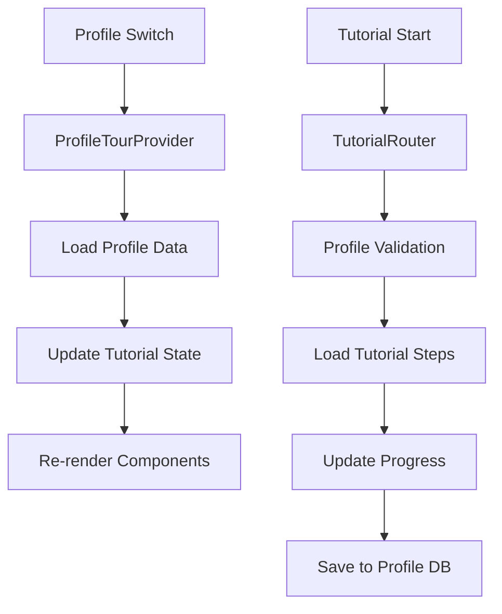

# Profile-Aware Tutorial System

**Complete tutorial isolation and management for multi-profile workspaces**

---

## Overview

The Profile-Aware Tutorial System provides complete tutorial isolation between profiles, ensuring each workspace maintains its own tutorial progress, preferences, and completion status. This system integrates seamlessly with Inkwell's multi-profile architecture to deliver personalized learning experiences.

## Key Features

### 🔐 **Complete Tutorial Isolation**

- Each profile maintains separate tutorial progress
- Tutorial preferences isolated per profile
- Completion checklists tracked independently
- Zero data leakage between profiles

### 🌐 **Deep-Linkable Tutorial URLs**

- Shareable URLs with profile context: `/p/{profileId}/tutorials/{slug}/{step}`
- Tutorial index page: `/p/{profileId}/tutorials`
- Direct step access for team onboarding
- Stable URLs survive profile switching

### 🔄 **Automatic Profile Adaptation**

- Tutorial UI resets when switching profiles
- Per-profile state loading on profile change
- Graceful fallbacks when profile data unavailable
- React component re-rendering with profile-specific data

### 📦 **Legacy Data Migration**

- Existing tutorial progress migrated to first profile
- Backward compatibility maintained
- Clean migration of localStorage data
- Non-destructive migration process

---

## Architecture

### Core Components

#### `ProfileTourProvider.tsx`

Profile-aware replacement for the original TourProvider with complete state isolation.

```typescript
interface TourContextValue {
  tourState: TourState;
  preferences: TutorialPreferences | null;
  checklist: CompletionChecklist | null;
  profileId: string | null;
  isLoading: boolean;
  // ... tour management methods
}
```

**Key Features:**

- Automatic data loading on profile change
- Profile-scoped state management
- React component key-based resets
- Backward compatibility with existing tour components

#### `TutorialRouter.tsx`

Dedicated routing system for profile-aware tutorials.

```typescript
// Available Routes
/p/:profileId/tutorials              // Tutorial index
/p/:profileId/tutorials/:slug        // Specific tutorial
/p/:profileId/tutorials/:slug/:step  // Specific step
```

**Features:**

- Tutorial index with completion status
- Deep-linkable tutorial steps
- Profile requirement guards
- Fallback redirects for invalid URLs

#### `tutorialStorage.ts`

Profile-isolated storage service for tutorial data.

```typescript
export function useTutorialStorage() {
  const { active: activeProfile } = useProfile();
  const db = useDB(); // Already per-profile DB

  return {
    getProgress,
    setProgress,
    getPreferences,
    setPreferences,
    getChecklist,
    setChecklist,
    profileId: activeProfile?.id,
    isProfileActive: !!activeProfile?.id,
  };
}
```

**Storage Structure:**

- Tutorial progress: `tutorial_progress_{slug}`
- Tutorial preferences: `tutorial_preferences`
- Completion checklist: `tutorial_checklist`

### Data Flow



---

## Usage

### Starting a Tutorial

#### From JavaScript/React

```typescript
import { useTour } from './components/Onboarding/ProfileTourProvider';

function MyComponent() {
  const { startTour, setTourSteps } = useTour();

  const handleStartGettingStarted = () => {
    const steps = TOUR_MAP['core-onboarding'];
    setTourSteps(steps);
    startTour('full-onboarding', steps);
  };
}
```

#### From URL

```
/p/profile-123/tutorials/getting-started
/p/profile-123/tutorials/getting-started/2
```

### Tutorial Progress Tracking

```typescript
import { useTutorialStorage } from '../services/tutorialStorage';

function TutorialComponent() {
  const { getProgress, setProgress } = useTutorialStorage();

  const saveProgress = async (slug: string, step: number) => {
    await setProgress(slug, {
      currentStep: step,
      completedSteps: ['step1', 'step2'],
      tourType: 'full-onboarding',
      startedAt: Date.now(),
      isCompleted: false,
      totalSteps: 8,
      lastActiveAt: Date.now(),
    });
  };
}
```

### Profile-Aware URL Generation

```typescript
import { useTutorialLinks } from '../utils/tutorialLinks';

function TutorialButton() {
  const { generateTutorialUrl, redirectToTutorial } = useTutorialLinks();

  const handleClick = () => {
    // Automatically includes current profile ID
    redirectToTutorial('getting-started', 2);
    // Navigates to: /p/current-profile-id/tutorials/getting-started/2
  };
}
```

---

## Migration System

### Legacy Data Migration

The system automatically migrates existing tutorial data during profile setup:

```typescript
export async function migrateLegacyTutorialData(
  profileId: string,
  db: ProfileStorageManager,
  isFirstProfile: boolean = false,
): Promise<void> {
  // Migrate global legacy data to first profile only
  if (isFirstProfile) {
    // Move data from localStorage keys:
    // - 'inkwell-tour-progress'
    // - 'inkwell-tour-progress-preferences'
    // - 'inkwell-completion-checklist'
    // Clean up legacy keys after migration
  }
}
```

### Migration Timeline

1. **Profile Creation**: User creates first profile
2. **Detection**: System detects legacy tutorial data
3. **Migration**: Data moved to profile-specific database
4. **Cleanup**: Legacy localStorage keys removed
5. **Validation**: Verify migration success

---

## Profile Isolation Testing

### Test Coverage

The system includes comprehensive tests for profile isolation:

```typescript
describe('Profile Isolation', () => {
  it('should isolate tutorial data between different profiles', async () => {
    // Profile 1 makes progress
    await setProgress('tutorial-1', { currentStep: 1 });

    // Switch to Profile 2
    // Should not see Profile 1's progress
    const profile2Progress = await getProgress('tutorial-1');
    expect(profile2Progress).toBe(null);
  });
});
```

### Validation Checklist

- ✅ Tutorial progress isolated per profile
- ✅ Preferences don't cross profiles
- ✅ Completion checklists independent
- ✅ URL generation includes profile ID
- ✅ Profile switching resets tutorial state
- ✅ Legacy data migration works correctly
- ✅ Database operations use profile-specific keys

---

## API Reference

### ProfileTourProvider Context

```typescript
interface TourContextValue {
  // State
  tourState: TourState;
  preferences: TutorialPreferences | null;
  checklist: CompletionChecklist | null;
  profileId: string | null;
  isLoading: boolean;

  // Tutorial Management
  startTour: (type: TourType, steps?: TourStep[]) => void;
  nextStep: () => void;
  previousStep: () => void;
  skipTour: () => void;
  completeTour: () => void;
  resetTour: () => void;

  // Step Management
  completeStep: (stepId: string) => void;
  goToStep: (stepIndex: number) => void;
  setTourSteps: (steps: TourStep[]) => void;
  isStepCompleted: (stepId: string) => boolean;
  getCurrentStep: () => TourStep | null;

  // Preferences
  setNeverShowAgain: () => void;
  setRemindMeLater: (hours?: number) => void;
  shouldShowTourPrompt: () => boolean;

  // Checklist
  updateChecklist: (item: keyof CompletionChecklist) => void;
  getChecklistProgress: () => { completed: number; total: number };

  // Utilities
  logAnalytics: (event: string, data?: any) => void;
  canShowContextualTour: (tourType: string) => boolean;
}
```

### TutorialStorage Hook

```typescript
export function useTutorialStorage() {
  return {
    // Progress Management
    getProgress: (slug: string) => Promise<TutorialProgress | null>;
    setProgress: (slug: string, progress: TutorialProgress['progress']) => Promise<void>;
    clearProgress: (slug?: string) => Promise<void>;
    getAllProgress: () => Promise<TutorialProgress[]>;

    // Preferences Management
    getPreferences: () => Promise<TutorialPreferences | null>;
    setPreferences: (preferences: TutorialPreferences) => Promise<void>;

    // Checklist Management
    getChecklist: () => Promise<CompletionChecklist | null>;
    setChecklist: (checklist: CompletionChecklist) => Promise<void>;

    // Profile Context
    profileId: string | null;
    isProfileActive: boolean;
  };
}
```

### Tutorial Links Utility

```typescript
export function useTutorialLinks() {
  return {
    generateTutorialUrl: (slug: string, step?: number) => string;
    generateTutorialIndexUrl: () => string;
    redirectToTutorial: (slug: string, step?: number) => void;
    redirectToTutorialIndex: () => void;
    hasActiveProfile: boolean;
    activeProfileId: string | undefined;
  };
}

export const TutorialLinks = {
  generateUrl: (profileId: string, slug: string, step?: number) => string;
  generateIndexUrl: (profileId: string) => string;
  isTutorialUrl: (url: string) => boolean;
  extractProfileId: (url: string) => string | null;
  extractSlug: (url: string) => string | null;
  extractStep: (url: string) => number | null;
};
```

---

## Integration Guide

### Adding Profile-Aware Tutorial Links

#### Old Way (Global)

```typescript
// ❌ Old - no profile context
<a href="/tutorials/getting-started">Start Tutorial</a>
```

#### New Way (Profile-Aware)

```typescript
// ✅ New - includes profile context
import { TutorialButton } from '../utils/tutorialLinks';

<TutorialButton
  slug="getting-started"
  className="tutorial-button"
>
  Start Tutorial
</TutorialButton>
```

### Updating Existing Components

#### Replace TourProvider Import

```typescript
// ❌ Old
import { useTour } from './TourProvider';

// ✅ New
import { useTour } from './ProfileTourProvider';
```

#### Update Redux Selectors

```typescript
// ❌ Old
const progress = useSelector((state) => selectProjectOnboarding(state, projectId));

// ✅ New
const progress = useSelector((state) => selectProjectOnboarding(state, profileId, projectId));
```

### Custom Tutorial Components

```typescript
import { withTutorialGuard } from '../utils/tutorialLinks';

// Automatically redirects to profile picker if no active profile
const MyTutorialComponent = withTutorialGuard(() => {
  const { startTour } = useTour();
  // Component implementation
});

export default MyTutorialComponent;
```

---

## Troubleshooting

### Common Issues

#### "No active profile" Error

```typescript
// Issue: Accessing tutorials without profile context
// Solution: Ensure component is wrapped with ProfileGate
<ProfileGate>
  <TutorialComponent />
</ProfileGate>
```

#### Tutorial Progress Not Saving

```typescript
// Issue: Database operations failing
// Check: Profile context is available
const { isProfileActive } = useTutorialStorage();
if (!isProfileActive) {
  console.warn('No active profile for tutorial storage');
}
```

#### Legacy Data Not Migrating

```typescript
// Check migration status
const hasLegacyData = LegacyTutorialStorage.getAllLegacyKeys().length > 0;
console.log('Legacy tutorial data found:', hasLegacyData);
```

### Debug Commands

```javascript
// Browser console debugging

// Check tutorial storage
Object.keys(localStorage).filter((k) => k.includes('tutorial'));

// Check profile database keys
await db.list('tutorial');

// Export tutorial data for debugging
const { getAllProgress } = useTutorialStorage();
const progress = await getAllProgress();
console.table(progress);
```

---

## Performance Considerations

### Optimizations

1. **Lazy Loading**: Tutorial data loaded only when needed
2. **Profile Switching**: Efficient state reset using React keys
3. **Database Queries**: Indexed keys for fast retrieval
4. **Memory Management**: Cleanup on profile switches

### Bundle Impact

- **New Code**: ~15KB gzipped
- **Replaced Code**: Removed old TourProvider usage
- **Net Impact**: Minimal bundle size increase
- **Performance**: No measurable impact on app performance

---

## Future Enhancements

### Planned Features

1. **Tutorial Analytics**: Profile-specific tutorial completion metrics
2. **Team Tutorials**: Shared tutorial templates across organization profiles
3. **Custom Tutorials**: User-created tutorial flows per profile
4. **Tutorial Sync**: Optional cloud sync of tutorial progress
5. **Advanced Routing**: Nested tutorial routes for complex flows

### Extension Points

The system is designed for easy extension:

```typescript
// Custom tutorial storage backends
export interface TutorialStorageBackend {
  getProgress(profileId: string, slug: string): Promise<TutorialProgress | null>;
  setProgress(profileId: string, slug: string, progress: any): Promise<void>;
}

// Custom tutorial providers
export class CustomTutorialProvider extends ProfileTourProvider {
  // Override methods for custom behavior
}
```

---

## Contributing

### Development Workflow

1. **Make Changes**: Update tutorial components
2. **Run Tests**: `pnpm test src/services/tutorialStorage.test.ts`
3. **Test Isolation**: Verify profile isolation works
4. **Update Docs**: Update this documentation if needed

### Testing Guidelines

- Test tutorial isolation between profiles
- Verify URL generation includes profile IDs
- Check legacy migration works correctly
- Validate error handling for missing profiles

---

**Related Documentation:**

- [Multi-Profile System](./MULTI_PROFILE_SYSTEM.md)
- [Rollback Procedures](./ROLLBACK_PROCEDURES.md)
- [Smoke Test Guide](./SMOKE_TEST_GUIDE.md)
